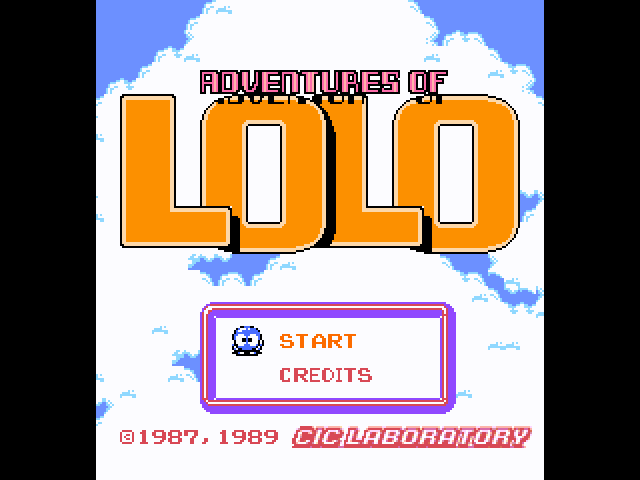
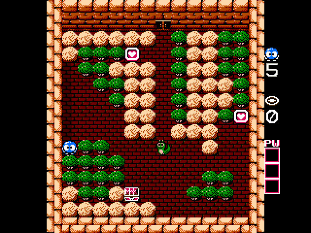
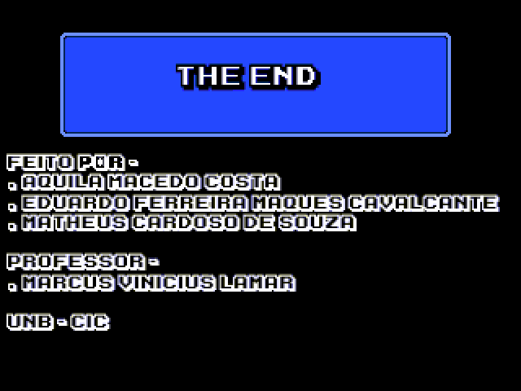

# Projeto final para o curso de Introdução a Sistemas Computacionais (ISC) - UnB

Nesse projeto fizemos a recriação do jogo _The Adventures of Lolo_.

Para informações sobre os detalhes técnicos do projeto, por favor consultar o
arquivo `relatorio.pdf` na raiz do repositório.

## Como executar o jogo

O arquivo principal, que deverá ser montado para posterior execução, pode ser
encontrado em `src/game.s` Note que este arquivo **não** pode ser movido de seu
diretório atual, pois seus arquivos de include também residem no diretório
`src`.

## Screenshots do projeto

